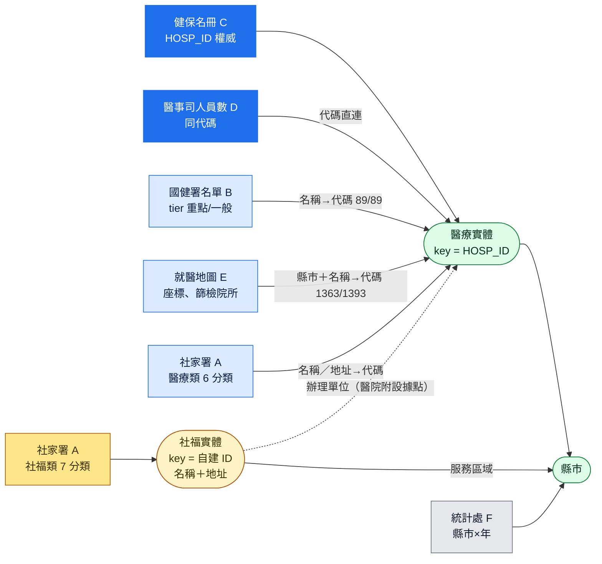

# 外部資源實測與統整方式（v1）

2026-09-11 實測。對應上層 `README.md` §7 的第 1、2、4（部分）、5、6（部分）項，並抽查 §7 第 3 項。
所有數字都來自本目錄 `scripts/` 實際抓取與解析的結果，可以重跑：

```bash
mkdir -p work && cd work
bash ../scripts/fetch.sh
/Users/lightman/miniforge3/bin/python ../scripts/parse_hpa.py   # 需要 pdfplumber
python3 ../scripts/parse_sfaa.py
python3 ../scripts/match.py
python3 ../scripts/odsread.py hfk_joint.ods
python3 ../scripts/odsread.py hfk_screen.ods
```

`data/` 放解析後的小檔（已對上健保代碼的 JSON、統計表、國健署 PDF）；原始 HTML 與健保名冊（12MB）不留，用 `fetch.sh` 重抓。

---

## 0. 結論

1. **名錄層能串起來，共同 key 是健保「醫事機構代碼」（10 碼）。** 國健署 89 家聯評中心 89/89 對得上；社家署醫療類分類大部分對得上；國健署篩檢院所 1,393 家中 1,363 家可唯一對上。
2. **社福類單位（通報轉介、個管、早療機構、社區據點）沒有任何公開代碼**，只能用「名稱＋地址」自建 ID，而且同一地址常常同時登記好幾種角色。
3. **動態層比 v0 假設的薄很多。** 抽查 13 家聯評中心網頁，只有中山醫附醫公布「放名額日」；新北、臺中衛生局的「預約情況」頁其實只寫預約方式，**沒有等候天數**；國健署也沒有公布各中心的等候時間。「等多久」這個欄位目前沒有可抓的公開來源。
4. **統計層比預期好**：衛福部統計處有 5 張早療統計表，都有縣市別；通報概況是按季更新（最新到 115 年第 2 季）。
5. **找到 v0 沒列的兩個來源**：衛福部「兒童醫療健康資訊整合平台」的就醫地圖（有座標、可匯出，還含 1,393 家兒童發展篩檢院所），以及臺中市社會局的「自費療育單位審查通過名單＋收費統計」（補上健保名冊缺的自費治療所）。

---

## 1. 來源實測表

| # | 來源 | 取得方式 | 筆數 | 關鍵欄位 | 有無代碼／座標 | 更新 | 狀態 |
|---|---|---|---|---|---|---|---|
| A | 社家署資源查詢 `system.sfaa.gov.tw/cecm/resourceView/detail2` | HTML，13 個分類，每類一頁即全量，無分頁、無 JSON | 2,265（去重名稱 2,041） | 縣市、名稱、郵遞區號、地址、電話、更新日期（100%）；服務區域 46%、服務方式 31%、服務內容 16%、網址 4% | 無代碼、無座標 | 每筆有「更新日期」，27% 停在 105–108 年 | ✅ 已解析 |
| B | 國健署 115 年聯評中心名單 PDF | PDF 2 頁，`pdfplumber` 抽表 | 89（重點 16、一般 73） | 縣市、全銜、電話、地址 | 無代碼；**重點中心只用淺紅底標示**，用色塊判讀 | 年更，本版 115-06-22 | ✅ 已解析 |
| C | 健保署「健保特約醫療院所名冊」`A21030000I-D2100G-001` | REST API `info.nhi.gov.tw/api/iode0010/v1/rest/datastore/{rid}?limit=1000&offset=` | 37,087（含已終止 5,526） | `HOSP_ID`、名稱、地址、電話、特約類別、型態別、權屬別、終止日 | **代碼的權威來源** | 每日 | ✅ 已抓 |
| D | 醫事司「醫療機構與人員基本資料」（data.gov.tw 15393） | ODS 年更（本版 2024-12-31） | 24,138 | 機構代碼、科別、**各類醫事人員數**（語言治療師、聽力師、PT、OT、臨床心理師…） | 代碼同 C | 年更 | ✅ 已抓 |
| E | 兒童醫療健康資訊整合平台就醫地圖 `healthforkids.mohw.gov.tw/HospitalMap` | 每類有「檔案下載」ODS；座標寫在頁面 JS（`TGOS.Point`，WGS84） | 聯評 88、篩檢院所 1,393 | 縣市、鄉鎮、名稱、電話、地址、備註 | 有座標（頁面內）；無代碼 | 頁面標 2025-04-01 | ✅ 已抓。**TLS 憑證 2026-09-10 過期** |
| F | 衛福部統計處早療統計 2.5.4–2.5.8 | xlsx／ods 直連 | 5 張表 | 縣市別 × 年（2.5.4 另有季） | — | 2.5.4 季更，其餘年更 | ✅ 已抓 |
| G | 新北市衛生局聯評聯絡資訊及預約情況 | HTML | 12 家新北＋16 家臺北合約評估醫院＋基隆 | 電話、預約方式文字、醫院連結（reurl 短網址） | — | 頁面日期 113-07 | ✅ 已看。**沒有等候資訊** |
| H | 臺中市衛生局同類頁 `health.taichung.gov.tw/1970993/post` | HTML＋附檔診次表 | 10 家 | 電話、網頁連結、診次附檔 | — | — | ✅ 已看。**沒有等候資訊** |
| I | 臺中市社會局自費療育單位 `society.taichung.gov.tw/461264/post` | PDF：年度審查通過名單、每季新增單位與人員、收費統計 | 未解析 | 療育項目 × 時長的收費（平均／最高／中位／最低） | — | 季更 | ⚠ 只看了收費統計 PDF，名單 PDF 未解析 |
| J | 各聯評中心自家網頁（抽 14 家） | HTML，模板各異；有 Big5、Google Sites、JS 渲染 | — | 見 §4 | — | 人工 | ⚠ 抽查，未全盤 |

v0 列過但未親自確認的：國軍臺中總醫院頁（curl 回 403）、桃園／高雄同類頁（搜尋結果有，未抓）。

---

## 2. v0 需要更正的地方

| v0 寫法 | 實測 |
|---|---|
| 社家署分類「通報轉介中心、個案管理中心、療育單位（早療機構含兼辦、到宅、社區療育、其他）」 | 實際是 13 類：服務單位 8 類（評估醫院、聯合評估中心、其他經許可辦理評估之醫院、新生兒聽力確診、新生兒聽力篩檢、通報轉介中心、個案轉介中心〔即個管〕、教育單位）＋療育單位 5 類（醫療單位、教育單位、早療機構、社區療育據點、其他社福單位）。沒有獨立的「到宅」分類，到宅寫在「服務方式」欄 |
| 新北衛生局頁是「縣市級彙整等候狀態的先例」 | 只有預約方式（「請先電話諮詢」「掛復健科某醫師」），沒有等候天數或名額 |
| 健保署治療所是「療育的實際供給端，數千家」 | 健保特約的治療所很少：物理治療所 32、職能治療所 11、語言治療所 **0**。自費治療所不在健保名冊。醫院與診所端的供給要看 D：有語言治療師的醫療機構 463 家、共 1,359 人（其中 445 家有復健科） |
| 社家署名錄「最完整」 | 聯評中心分類只有 82 筆（去重後 77 家）。國健署 89 家中有 13 家在這個分類對不到：3 家是更名沒同步（陽明大學→陽明交通大學、臺大新竹分院→新竹臺大分院新竹醫院、彰基→彰基兒童醫院）；6 家被放在「評估醫院」分類（聯新、屏東醫院、連江縣立、基隆長庚、淡水馬偕，以及和更名重疊的臺大新竹）；其餘 5 家（旗津、惠民、高醫岡山、埔基、台南市立）完全沒列在聯評分類 |
| 通報數「111 年全國 3 萬 907 名」 | 正確；114 年（2025）已到 45,892 |
| 「⚠ 是否有縣市級 CSV」 | 有，統計處 2.5.4 有縣市別，季更 |

---

## 3. 統整方式

### 3.1 實體與 key



### 3.2 對應規則（`scripts/match.py`，已實測）

正規化：NFKC、`㇐`→`一`、`台`→`臺`、去掉括號與空白；比對「核心名」時再去掉法人前綴（醫療財團法人、天主教…）和「(委託…經營)」尾巴。

依序：

1. 核心名在健保名冊裡唯一 → 採用
2. 地址核心（路段＋號）相同，**排除居家護理所**，只剩一筆或只剩一家醫院 → 採用
3. 同縣市、特約類別為醫院、名稱互為子字串且唯一 → 採用
4. 其餘 → 不配，進人工 alias 檔

實測踩到的坑（都已經寫進規則）：

- 醫院地址常同時登記「附設居家護理所」，只用地址比對會配錯（陽明交大、臺大生醫都中過）
- 子字串比對不限縣市時，「臺大新竹分院」會配到臺北的臺大本院
- **社福單位不能拿去比對健保名冊**：同址的診所、幼兒園會被誤配（例如新北第 3 區社區資源中心配到同址診所）。所以社福 7 類一律不配代碼
- 「嘉基附設社區據點」這種要建成 relation（辦理單位→醫院），不能合併成同一個實體
- 篩檢院所是診所，全國同名很多（「新原診所」），要用「縣市＋全名」比對，唯一率 97.8%；配不到的 25 筆多半是「臺北市立聯合醫院(婦幼院區)」這類院區寫法

必須人工維護的 alias 檔（首批）：陽明大學→陽明交通大學、臺大新竹分院→`0412040012`、SFAA「生醫醫院竹東院區」與「竹北院區」同屬 `0433050018`（一個代碼兩個院區）。

### 3.3 三個來源對聯評中心的交叉結果

| | 家數 | 與國健署交集 |
|---|---|---|
| 國健署 B（定義來源） | 89 | — |
| 就醫地圖 E | 88 | 88（少臺北榮總）；**全部標「一般中心」，重點中心的分級沒更新** |
| 社家署 A「聯合評估中心」 | 82 筆→77 家 | 76 |

所以 `tier` 只能以國健署 PDF 為準；座標從 E 拿；社家署 A 用來補服務時間、服務區域與「更新日期」。

---

## 4. 動態層：抽查 13 家聯評中心網頁

來源：新北衛生局頁上的醫院連結（11 家，新北聯醫無連結）＋中山醫附醫＋新竹馬偕；國軍臺中總醫院回 403，不計。

| 能取得的資訊 | 家數 | 例子 |
|---|---|---|
| 放名額日（可以解析成 event） | 1 | 中山醫附醫：「115年10月份…115/9/24(四)中午12點開放」，一次預告 3 個月；每月 80–120 名 |
| 門診時段／每診名額 | 6 | 亞東：週二上下午、週四上午，每診 9–12 名；耕莘：週二上午，每診限 5 名；恩主公：週四下午；雙和：週三上午；臺北醫院：週四上午；新竹馬偕：週二、三 |
| 只有介紹或「請先電話諮詢」 | 4 | 土城長庚、輔大、淡水馬偕、台北慈濟 |
| 抓不到內容 | 2 | 永和耕莘、汐止國泰（JS 渲染或內容是圖片） |

解析要注意：耕莘、恩主公的網頁是 Big5 編碼；新北頁上的連結都是 reurl 短網址，要先展開。耕莘頁另外寫了「365 天內無法重複評估」，這類規則適合放進旅程頁。

換句話說，可以穩定抓的動態欄位是：**預約方式、門診時段、放名額日（少數）**。「等多久」目前沒有任何公開來源，要做只能靠人工電訪或家長回報，而後者違反 v0 §5 第 1 條。

---

## 5. 統計層：供需對照（2025 通報數 ÷ 國健署聯評家數）

| 縣市 | 2025 通報 | 聯評家數 | 重點 | 每家通報數 |
|---|---|---|---|---|
| 彰化縣 | 3,346 | 3 | 1 | 1,115 |
| 臺北市 | 3,629 | 4 | 1 | 907 |
| 桃園市 | 3,762 | 5 | 1 | 752 |
| 新北市 | 9,002 | 12 | 2 | 750 |
| 新竹市 | 1,256 | 2 | 2 | 628 |
| 花蓮縣 | 1,217 | 2 | 1 | 608 |
| 屏東縣 | 2,273 | 4 | 1 | 568 |
| 臺中市 | 5,596 | 10 | 3 | 560 |
| 雲林縣 | 1,645 | 3 | 0 | 548 |
| 嘉義縣 | 974 | 2 | 0 | 487 |
| 新竹縣 | 1,397 | 3 | 0 | 466 |
| 基隆市 | 841 | 2 | 0 | 420 |
| 苗栗縣 | 1,238 | 3 | 0 | 413 |
| 臺南市 | 3,017 | 8 | 2 | 377 |
| 南投縣 | 977 | 3 | 0 | 326 |
| 臺東縣 | 598 | 2 | 0 | 299 |
| 高雄市 | 3,465 | 12 | 2 | 289 |
| 宜蘭縣 | 785 | 3 | 0 | 262 |
| 嘉義市 | 568 | 3 | 0 | 189 |
| 澎湖縣 | 188 | 1 | 0 | 188 |
| 金門縣 | 98 | 1 | 0 | 98 |
| 連江縣 | 20 | 1 | 0 | 20 |
| 全國 | 45,892 | 89 | 16 | 516 |

注意：臺北市另有十幾家非國健署補助的評估醫院（新北頁列了 16 家臺北合約評估醫院），所以臺北的實際量能被低估。這張表適合放在縣市頁當背景，不適合拿來排名。

統計處 5 張表：2.5.4 通報概況（季，按年齡、通報來源）、2.5.5 個案管理概況、2.5.6 收托單位及人數、2.5.7 療育服務人數（按醫療院所／到宅／日間／時段）、2.5.8 補助概況（交通費、療育訓練費、金額）。部分分頁頁尾的「更新日期」看起來是從前一年複製過來的，引用時要以「歷年」頁為準。

---

## 6. 對產品方向的影響

- **名錄＋地圖＋旅程**：資料齊全，可以直接做。篩檢院所（E，1,393 家）補上了旅程第一段，v0 沒有這一段。
- **「本週放名額」頁**：目前只有少數中心有公開資訊，撐不起一個獨立頁型。比較實際的做法是在單位頁上顯示「預約方式＋門診時段＋放名額日（有的話）」。
- **療育供給**：醫院端用 D（治療師人數），自費端用各縣市社會局的自費療育單位名單（臺中已確認有，而且含收費統計），比健保名冊實用。
