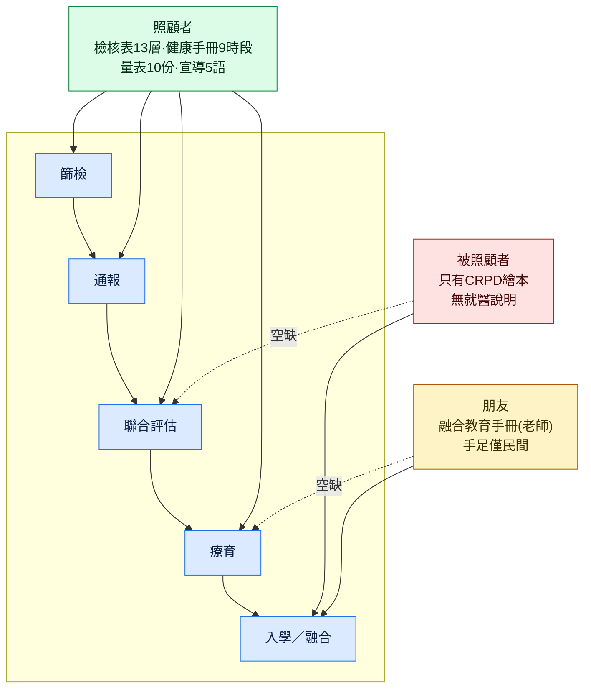

# 教育素材：照顧者／被照顧者／朋友三方的來源實測（v1）

2026-09-12 實測。承接 `research/2026-09-11-sources/`（機構名錄與動態層），這份只處理**教育與衛教素材**：家長要看什麼、孩子自己能看什麼、身邊的人（同學、手足、老師）能看什麼。

所有數字都來自實際抓取與解析，可重跑：

```bash
mkdir -p work && cd work
bash ../scripts/fetch_edu.sh
```

`data/edu_inventory.json` 是解析後的素材清單（檢核表 13 個年齡層、社家署宣導 27 筆、國健署量表、臺北市手冊、融合教育 9 冊、CRPD 繪本）。

---

## 0. 結論

1. **照顧者這一方資料最齊，而且是結構化的**：社家署的線上兒童發展檢核表有 13 個年齡層、每層 11–13 題，可以直接 POST 取得題目；兒童健康手冊有 9 個時段的「家長紀錄事項」。這是全站唯一「可以互動、可以按年齡分頁」的教育內容。
2. **被照顧者（孩子本人）幾乎沒有官方素材。** 唯一能直接給孩子看的是 CRPD 手語繪本與注音學習單，而它講的是「認識身心障礙、友善環境」，不是「你要去做評估了，那裡會發生什麼事」。**「給孩子的就醫／評估說明」是整個題目最大的內容空缺。**
3. **朋友這一方有教材，但對象全是老師，不是同學。** 臺北市融合教育現場教學手冊 9 冊（含專章談發展遲緩）寫給教師；教育部特教萬事屋只有 5 筆教案，且是特教班課程。真正「講給同學聽」的只有 CRPD 繪本。
4. **手足只有民間有系統地做**：天使心家族的手足專區（QA 五類、手足團體、營隊）。官方素材完全沒有觸及手足。
5. 社家署 cecm 的「**教材專區是空的（0 筆）**」，但「宣導資料」有 27 筆，其中早療宣導單張有中／英／越南／泰／印尼 5 種語言——新住民家庭的需求在名錄層看不到，在素材層看得到。

---

## 1. 照顧者（家長、主要照顧者）

| 來源 | 內容 | 型式與取得 | 實測 |
|---|---|---|---|
| 社家署線上兒童發展檢核表 | 13 個年齡層：4 個月、6 個月、9 個月、1 歲、1 歲 3 個月、1 歲半、2 歲、2 歲半、3 歲、3 歲半、4 歲、5 歲、6 歲 | `POST /cecm/screenView/form`，帶 `birthDt=YYYY/MM/DD`，回傳該年齡層的整份表單 | 每層 **11–13 題**發展題，★標示為警訊題（例：2 歲半 12 題中 7 題是警訊題）；另有 5 題危險因子（先天性異常、產前產程產後問題、腦部疾病或受傷、家族史或環境）。題目是完整中文句子，例如「★1. 能不須扶東西輕易地蹲下玩玩具然後恢復站的姿勢」 |
| 國健署兒童發展篩檢量表 | 9 次篩檢檢核總表＋分齡量表（6-9 個月、9-12、12-15、15-18、18-24 個月、2-3 歲、3-4、4-5、5-7 歲） | PDF，`hpa.gov.tw` nodeid 4821；另有圖卡及工具規格 4822、服務方案 4824 | 10 份 PDF，可直接下載 |
| 兒童健康手冊（115 年 6 月版） | **9 個時段的「家長紀錄事項」**：出生後二週至二個月、二至四個月、四至六個月、六個月至一歲、一歲至一歲半、一歲半至二歲、二歲至三歲、三歲至五歲、五歲至未滿七歲；另含**兒童發展篩檢服務就醫憑證 6 次**（6至10個月、10個月至1歲半、1歲半至2歲、2至3歲、3至5歲、5歲至未滿7歲）與**兒童預防保健 9 次** | PDF 103 頁、25MB | 另有英、越、印、柬、泰 5 種外語版（109 年 9 月版，113／115 年補上篩檢憑證） |
| 社家署宣導資料 | 27 筆：早療宣導單張（中／英／越／泰／印尼，各 2 版）、宣導短片（國語／臺語／客語）、寶貝發展篩檢指南光碟（6 個月～2 歲半共 6 個年齡）、新生兒聽力篩檢短片、社區療育服務單位一覽表 | 單張是 `.jpg`；影片是 YouTube 內嵌（**無檔案可下載**） | 清單可解析，檔案逐筆在 detail 頁 |
| 社家署教材專區 | — | — | **0 筆，是空的** |
| 臺北市早療服務手冊（115 年版） | 服務流程、資源、補助 | PDF 74 頁、33MB | **圖檔型 PDF，沒有文字層**（全文只有 2,882 字元），不能做全文檢索；另有英文版、越南文版與「早療兒童入公立非營利幼兒園轉銜手冊」 |

實務含意：家長端唯一適合做成互動頁的是**檢核表**（13 個年齡層 × 11–13 題，已經是結構化資料）。其他都是 PDF，只能做「導向與說明」，不要重製。

---

## 2. 被照顧者（孩子本人）

| 來源 | 內容 | 實測 |
|---|---|---|
| CRPD《希兒與皮帝的神奇之旅：臺灣手語繪本》 | 繪本本體 25 頁 PDF（17MB）、注音版學習單 2 頁、Q&A 互動簡報（pptx／odp） | 下載端點 `crpd.sfaa.gov.tw/BulletinCtrl?func=downloadFile&type=file&id=…&code=…`；非營利可自由下載使用，重製或改作要來信申請 |
| CRPD《每一個都要到 臺灣手語繪本》 | 另一本繪本＋動畫 | 同站 `bulletinId=842` |
| 社家署寶貝發展篩檢指南光碟 | 6 個年齡的篩檢說明影片 | YouTube 內嵌，內容是拍給家長看的 |

**空缺（本題最值得做、也最需要先畫倫理界線的一塊）**：沒有任何官方素材向孩子本人解釋「聯合評估那天會發生什麼事」「為什麼要一個一個房間去」「治療課是在做什麼」。國外醫院常見的 pre-visit story／social story，臺灣的聯評中心網頁上一份都沒有（13 家抽查中 0 家）。

---

## 3. 朋友（同學、手足、老師）

| 對象 | 來源 | 實測 |
|---|---|---|
| 老師 | 臺北市融合教育現場教學手冊 | 上冊 6 章＋下冊 3 章＋1 份情緒行為問題處理指引，共 10 份 PDF。**上冊第六章就是「發展遲緩學生的認識與輔導策略」**（第 117 頁起，含定義、特徵、案例分享、資源與支援）。單冊約 1.7MB，可直接下載 |
| 老師 | 教育部特教萬事屋教案分享 | **只有 5 筆**，且都是特教班／資源班的功能性課程教案，與同儕教育無關 |
| 同學 | CRPD 繪本＋學習單 | 唯一能直接在班上用的官方素材（認識友善空間、尊重差異） |
| 手足 | 天使心家族基金會手足專區 | QA 五類（含「我該如何與父母討論照顧議題」等成年手足議題）、手足團體、營隊、慶生會。**官方完全沒有手足素材** |

實務含意：「朋友」這一方如果要做，能引用的官方素材只有融合教育手冊（老師用）與 CRPD 繪本（同學用）兩條線，其餘要靠民間。

---

## 4. 三方 × 旅程階段的覆蓋情形



照顧者這一方在旅程前四段都有素材；孩子本人與朋友這兩方，只在「入學／融合」那一段才有東西，而最需要說明的「聯合評估當天」反而完全空白。

---

## 5. 統計：學前特教安置可以對照早療通報

教育部特教統計（`data.gov.tw/dataset/176892`，CSV 可直接下載）中「發展遲緩」類別：

| 學前-幼幼班 | 學前-小班 | 學前-中班 | 學前-大班 | 國小以後 |
|---|---|---|---|---|
| 1,107 | 5,071 | 8,858 | 10,377 | 0 |

合計學前 **25,413 人**（國小以後為 0，因為 6 歲後會改判為特定障礙類別）。對照社家署 2025 年通報 45,892 人，兩者的差距本身就是一個值得解釋給家長聽的問題：通報不等於安置。

---

## 6. 技術踩雷紀錄

- **健康九九（health99.hpa.gov.tw）取不到**：`/material`、`/theme/1`、`/health99/HealthEducation` 與 API 猜測路徑，curl 與 WebFetch 都是 302 無限重導（超過 50 次）。需要真實瀏覽器才能列出素材清單。國健署本站的 `EBookList.aspx?nodeid=53/54` 可以取代大部分需求。
- **crpd.sfaa.gov.tw 單頁 4–7MB**：圖片以 base64 內嵌，正則要先切片再比對，否則會回溯爆炸（實測跑超過 180 秒）。檔案連結不在 `href` 的檔名上，而是 `?func=downloadFile&type=file&id=&code=` 這種帶驗證碼的端點。
- **臺北市與部分縣市手冊是圖檔 PDF**，沒有文字層，不能全文檢索，也不能自動抽段落。
- **教育部兩個站都取不到結構化資料**：`special.moe.gov.tw` 是 Vue SPA；`set.edu.tw` 是 Big5＋ASP，定期統計查詢路徑 404。學前安置數據改走 `data.gov.tw` 開放資料。
- 社家署宣導資料的影片全部是 YouTube 內嵌，站上沒有檔案，引用時只能連外。

---

## 7. 對主站的接法

1. **旅程頁每一步掛素材**：篩檢掛檢核表與健康手冊、評估掛聯評中心頁與（待補的）孩子版說明、療育掛補助與自費名單、入學掛融合教育手冊與特教通報。
2. **檢核表做成互動頁**（13 個年齡層），但結果只顯示「建議諮詢」與所屬縣市通報轉介中心，不做判讀、不儲存孩子資料——這條界線和 v0 §5 第 1 條一致。
3. **素材頁只做索引與導向，不重製 PDF**：標來源、版本年月、語言、檔案大小，連回原站。CRPD 繪本雖然允許非營利下載，重製仍要申請授權。
4. **多語是現成的差異化**：早療宣導單張 5 語、兒童健康手冊 6 語，名錄層完全沒有這個維度。
5. 素材更新很慢（年更為主），source ingest 用年更加檔案 hash 比對即可，不需要每日抓。
