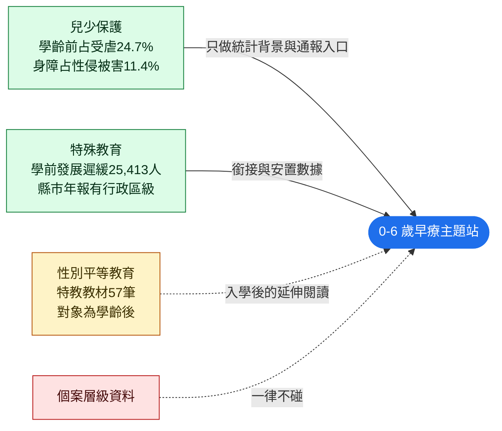

# 性平、兒少保、特教：三個相鄰領域的來源實測（v1）

2026-09-12 實測。承接 `research/2026-09-11-sources/`（機構名錄）與 `research/2026-09-12-education/`（三方教育素材）。這份回答的問題是：**這三個領域各有什麼可用資料，哪些真的和 0–6 歲早療接得上，哪些是「之後才會用到」。**

可重跑：

```bash
mkdir -p work && cd work
bash ../scripts/fetch_topics.sh
```

---

## 0. 結論

1. **兒少保的資料最完整，也最需要克制。** 統計處有 17 張兒少保護表、6 張性侵害表、6 張家暴表，全部半年更新且有縣市別。**學齡前（0–未滿6歲）占受虐兒少 24.7%**，這個數字足以支撐一段背景說明，但個案層級的東西站上一律不能碰。
2. **唯一把「身心障礙」與「被害」交叉的官方表是性侵害統計 3.2.2**：2025 年性侵害被害人 9,565 人中，身心障礙者 1,091 人（11.4%），其中智能障礙 332 人最多。早療家長最擔心的「孩子將來會不會被欺負」，只有這張表能給出有根據的答案。
3. **性平教材量很大但年齡對不上**：教育部性平網特教教學資源共 73 筆，其中 57 筆是特教性平教材（含 7 個障礙類別各一套、智能障礙學生補充教材 38 筆），但對象全是**高中職以下的在學學生，不是學齡前**。對本站是「之後的路」，不是現在。
4. **特教最有價值的發現是縣市年報**：教育部特教通報網本身取不到結構化資料，但**縣市特教資源中心的統計年報 PDF 有鄉鎮市區級的發展遲緩安置人數**（臺南市 113 學年度，83 頁，逐行政區列出）。這是目前找到唯一比縣市更細的早療相關數據。
5. 三個領域的官方系統有一個共同問題：**入口都是通報，不是資訊**。「關懷e起來」只有通報表單，沒有任何開放資料。

---

## 1. 兒少保護

### 1.1 統計來源（衛福部統計處，半年更新）

| 表號 | 表名 | 本題用途 |
|---|---|---|
| 3.5.1–3.5.17 | 兒少保護：通報處理、調查處理、施虐死亡、保護安置、**受虐類型**、**受虐人數**、施虐者身分／年齡／教育程度／本身因素、處遇計畫、結轉案、性剝削 3 張 | 受虐人數與類型是唯二用得上的 |
| 3.2.1–3.2.6 | 性侵害：通報案件、**被害及嫌疑人概況**、保護扶助人次與金額、裁罰、加害人處遇 | 3.2.2 是唯一有身心障礙別交叉的表 |
| 3.1.1–3.1.6 | 家庭暴力 6 張 | 背景，本題不直接用 |
| 2.1.1–2.1.5 | 弱勢兒少扶助、家外安置、違反兒少權法 | 背景 |

實測數字（2025 年，全國）：

- **3.5.6 受虐人數**：9,898 人。0–未滿3歲 1,122 人（男 644／女 478）、3–未滿6歲 1,320 人（男 769／女 551）→ **學齡前合計 2,442 人，占 24.7%**。
- **3.5.5 受虐類型**：身體不當對待 5,170、**性不當對待 3,109（男 452／女 2,657）**、疏忽 1,106、精神不當對待 436、目睹家暴 57、遺棄 20。
- **3.2.2 性侵害被害人**：9,565 人，其中 0–未滿6歲 231 人。身心障礙別：非身心障礙 8,474、智能障礙 332、精神病患 316、其他障礙 130、多重障礙 98、肢障 51、聽障 19、視障 13、聲（語）障 6、不詳 126 → **身心障礙被害人 1,091 人，占 11.4%**。

### 1.2 各場域統計（保護服務司，PDF 9 頁，110–112 年）

六個場域的通報件數與個案受虐類型：

| 場域 | 110 年 | 111 年 | 112 年 | 110–112 個案數 |
|---|---|---|---|---|
| 家內 | 24,521 | 24,851 | 26,559 | 22,544 |
| 學校（不含生對生） | 907 | 1,330 | 1,656 | 975 |
| 補教 | 194 | 221 | 399 | 202 |
| **幼教** | 149 | 133 | — | 114 |
| 托育 | 72 | 248 | 287 | 341 |
| 安置 | 75 | 88 | 120 | 106 |

**幼教場域 112 年 3 月起因幼照法與教保人員條例施行，全數回歸教育主管機關主政，所以衛福部這份只到 111 年**——要看 112 年以後的幼兒園案件，得改找教育部，這是資料斷點。

個案受虐類型：幼教場域 114 人中性不當對待 8 人（7%）、疏忽 14 人（12%）；托育場域 341 人中身體不當對待 227 人（66%）、疏忽 101 人（30%）。

### 1.3 通報入口

「關懷e起來」（`ecare.mohw.gov.tw`）只有線上通報表單與案件查詢，**沒有任何開放資料**；另有 113 保護專線。站上能做的就是把入口標清楚。

---

## 2. 性別平等教育

教育部性別平等教育全球資訊網「特教教學資源」（`gender.edu.tw/web/index.php/m5/m5_05_07_index`，共 5 頁）：

- 清單合計 **73 筆**，其中 16 筆是原住民族語繪本（被放在同一區），**真正的特教性平教材 57 筆**。
- 障礙類別各一套：語言類、視障類、智能類、自閉症類、情障類、聽障類、學習障類。
- 課程手冊：性別平等教育議題融入特殊需求領域「社會技巧」與「生活管理」課程手冊。
- **性教育教材手冊**（102 年 12 月，標題為「特殊教育（身心障礙類）學生性教育教材手冊」）：**306 頁、102MB PDF**；另有「性教育教材教學調整建議」。
- **智能障礙學生性別平等教育補充教材 38 筆**，分四個領域：實用語文（我長大了、男女大不同、作自己的主人、男女生衛生保健…）、社會適應（學校安全、法律常識、性侵害的法律刑責…）、休閒教育、生活教育（性別認識、性別的相處與交往、生理與心理成長發展…）。抽驗「生活教育—性別認識」為 19 頁 PDF。
- 其他：智能障礙者人身安全保護及性侵害防治教材（100.12 內政部）、性別平等教育手語畫冊、性侵害防治教戰手冊、認識校園危險區教材、國語日報彙編身心障礙學生性平教育策略手冊。

檔案可直接下載，路徑是 `gender.edu.tw/web/upload/SpecialResource/<中文檔名>.pdf`，同一份通常同時有 `.doc` 版。

**判斷**：這批教材的對象是高中職以下在學學生（多數是國中以上），0–6 歲用不到。但「身體界線、身體自主權」是早療家長會提前問的問題，可以放在旅程的「入學之後」那一段當延伸閱讀，不要放在前面。

---

## 3. 特殊教育

| 來源 | 狀態 | 內容 |
|---|---|---|
| `data.gov.tw/dataset/176892` 特殊教育各障礙類別學生人數 | ✅ CSV 可直接下載 | 發展遲緩：學前幼幼班 1,107、小班 5,071、中班 8,858、大班 10,377，**合計 25,413**；國小以後為 0（6 歲後改判類別） |
| 教育部特教通報網 `set.edu.tw` | ⚠ 取不到 | 統計年報頁是 Big5＋ASP，電子書區沒有可解析的檔案連結；定期統計查詢路徑 404 |
| 教育部全國特教資訊網 `special.moe.gov.tw` | ⚠ 取不到 | Vue SPA，首頁只有 1.7KB 的殼 |
| 優質特教網 `sencir.spc.ntnu.edu.tw` 特教教材資料庫 | ⚠ 取不到 | 列表由 JS 產生，沒有可用端點 |
| **縣市特教資源中心年報** | ✅ 最有價值 | 臺南市 104–113 學年度年報全部可下載。**113 學年度 83 頁 6MB，第三節「學前階段各行政區身心障礙學生人數及比率」逐行政區列出發展遲緩人數**（新營區 104、麻豆區 77、鹽水區 19…） |

**判斷**：全國層級的特教資料只能到「縣市×年級」；要做到行政區層級，只能一個縣市一個縣市去找資源中心年報。臺南已驗證可行，其餘 21 縣市待盤。

---

## 4. 三個領域跟本題的關係



具體建議：

1. **兒少保**：只放兩件事——通報入口（113、關懷e起來）與一段有數字的背景（學齡前占 24.7%）。不做案件地圖、不做機構風險評比，這會直接踩到 v0 §5 的界線。
2. **性平**：放在「入學之後」的延伸，標明教材對象是學齡後學生，避免家長誤以為是給幼兒的。
3. **特教**：`data.gov.tw` 那張 CSV 直接用；縣市年報值得排一輪人工盤點，因為那是唯一的行政區級數據，剛好補上本站「行政區頁」需要的密度。

---

## 5. 技術踩雷紀錄

- 衛福部 `dl-*.html` 下載連結的副檔名會騙人：`dl-92296-*.html` 存成 `.xlsx` 其實是 **PDF**，要先 `file` 判斷再選解析器。
- 統計處 xlsx 是多層表頭（第 4–6 列才是欄位名），欄位要靠三列合併才能對位，直接 `header=0` 會全錯。
- `gender.edu.tw` 的檔案路徑含中文與空白，要先 URL encode；同一份教材同時存在 `.pdf` 與 `.doc`，清單頁上看不出來。
- `crc.sfaa.gov.tw`（CRC 兒童權利公約資訊網）與 `health99.hpa.gov.tw` 都是 302 無限重導，curl 取不到。
- 社家署「心智障礙者的性教育教學參考資源」的附件連結帶加密參數且需 session，直接抓回來的是首頁 HTML。同樣的教材在性平網可以直接下載，改走那邊。
